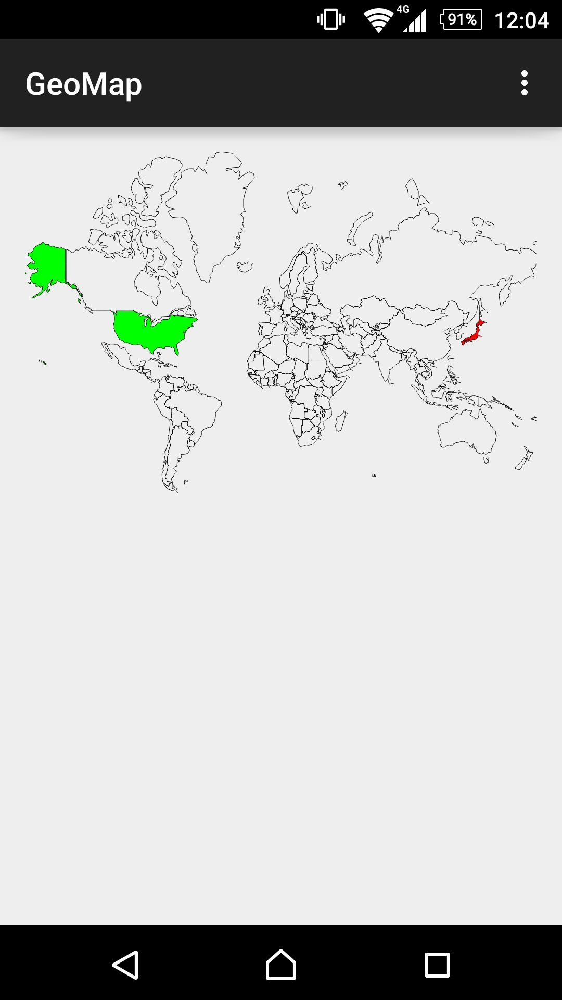

# GeoMap
GeoMapView library for Android

This library uses [world.svg](https://github.com/takuseno/GeoMap/blob/master/geomap/src/main/res/raw/world.svg) under 
[Creative Commons Attribution-NonCommercial 4.0 International License](http://creativecommons.org/licenses/by-nc/4.0/)

##Usage
``` .java
GeoMapView geoMapView = (GeoMapView)findViewById(R.id.geoMap);
geoMapView.setOnInitializedListener(new OnInitializedListener() {
    @Override
    public void onInitialized(GeoMapView geoMapView) {
        geoMapView.setCountryColor("US", "#00FF00");
        geoMapView.setCountryColor("JP", "#FF0000");
        geoMapView.refresh();
    }
});
```

##Screenshot
<p>
    
</p>
